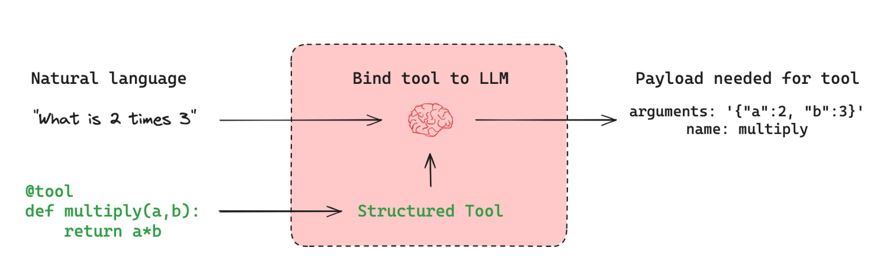

# RangChain과 RangGraph

## LangGraph란

- 대규모 언어 모델을 활용한 복잡한 워크 플로우와 의사결정 프로세스를 구현
- 멀티 에이전트 기반의 LLM 애플리케이션을 효과적으로 만들 수 있는 강력한 기술
- 랭체인 팀에서 지원하는 프레임워크

- Rangchain : 개발 과정이 상대적으로 간단하지만 복잡한 워크 플로우 관리에는 한계가 존재
- RangGraph : 랭체인 기반이지만, 상태 기반 그래프 구조를 통해 복잡하고 동적인 워크 플로우 구성

| 특징 | LangGraph | LangChain |
| --- | --- | --- |
| 주요 목적 | **복잡한** 워크 플로우 및 의사결정 프로세스 구현 | LLM 통합 및 체인 구성 |
| 구조 | **그래프** 기반 | 체인 및 에이전트 기반 |
| 상태 관리 | 명시적이고 세밀한 제어 | 암시적이고 자동화된 관리 |
| 유연성 | 높음 (커스텀 로직 쉽게 구현) | 중간 (미리 정의된 컴포넌트 중심) |
| 학습 곡선 | 상대적으로 가파름 (랭체인 → 랭그래프 학습) | 상대적으로 완만 |
| 용도 | 복잡한 AI 시스템 (RAG 등), 멀티 에이전트 | 간단한 LLM 애플리케이션 RAG |

# Tool Calling

## Tool Calling이란?

- LLM이 외부 기능이나 데이터에 접근할 수 있게 해주는 메커니즘
- LLM의 한계(최신 정보 부족, 특정 작업 수행 불가 등)를 극복하는 방법(RAG에서도 중요)
- LLM과 외부 도구 연동의 필요성 : 실시간 데이터 접근, 특수 기능 수행, 정확성 향상 등

- 검색할 때, llm을 통해 웹 서치에 필요한 검색어로 변환해줌
- 도구 호출에 있어서는 성능이 좋은 모델을 사용하는게 좋음
